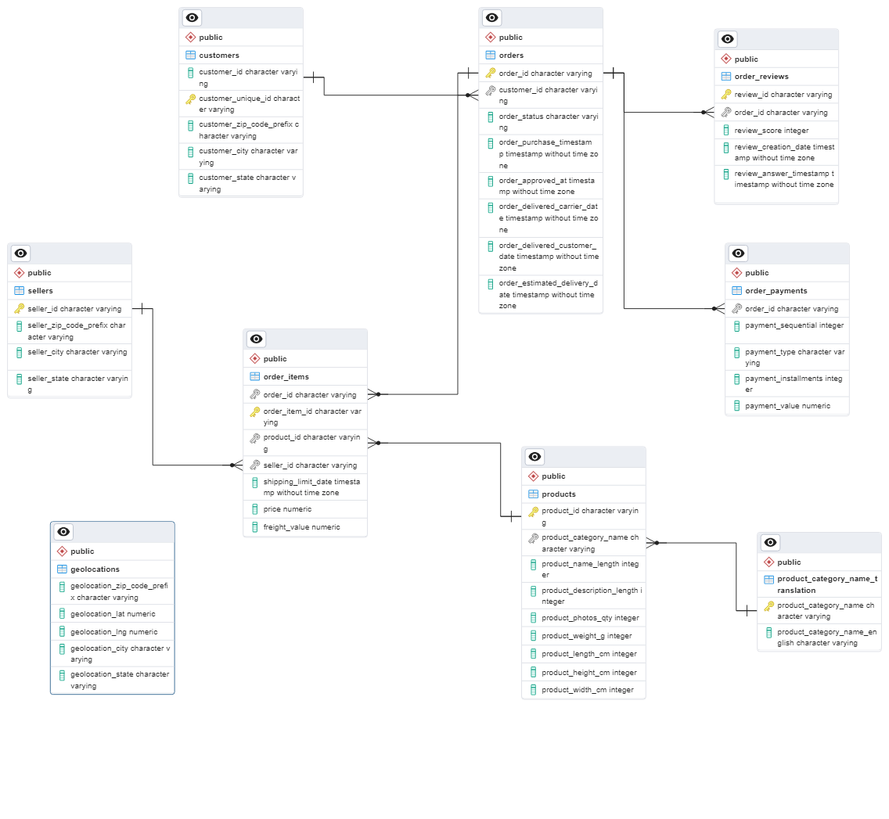
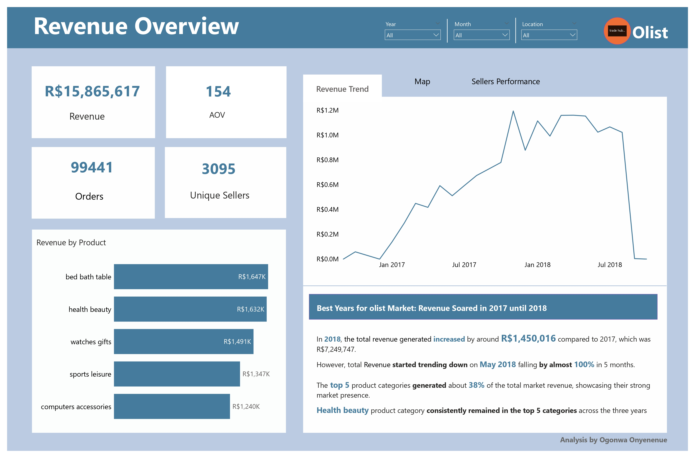
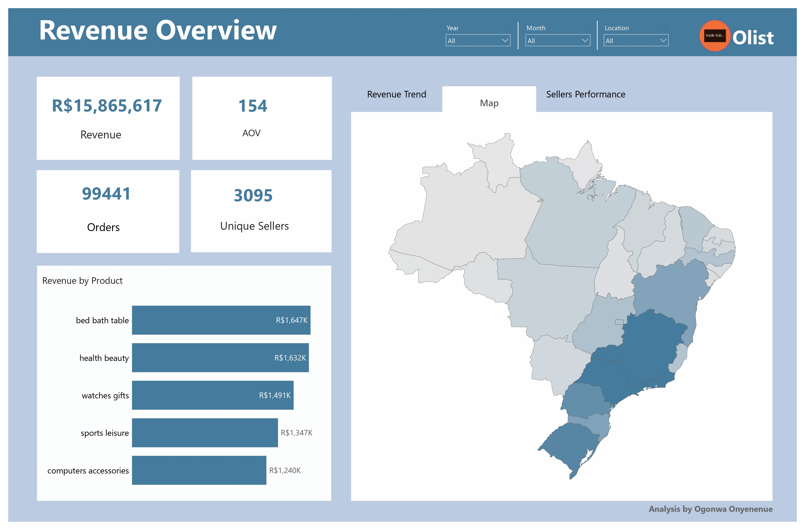
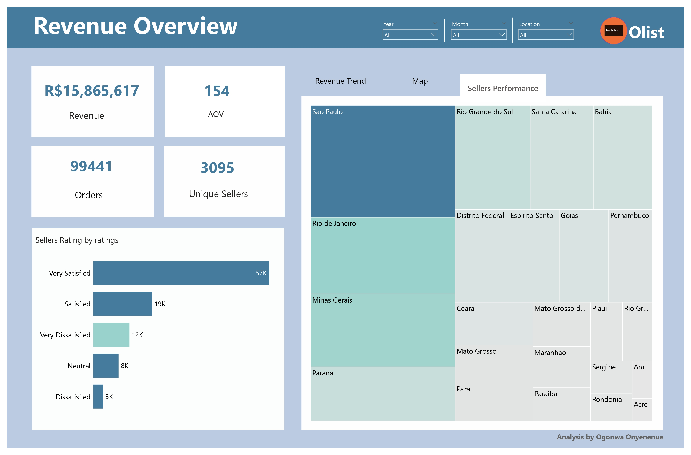

# Olist E-commerce Analysis

## Introduction

Olist is a Brazilian e-commerce platform that connects small and medium-sized businesses to customers across Brazil. The platform operates as a marketplace, where merchants can list
their products and services and customers can browse and purchase them online. The Olist sales dataset available on [Kaggle](https://www.kaggle.com/datasets) is a collection of anonymized data about orders
placed on the Olist platform between January 2017 and August 2018. It contains a wide range
of information about each order, including the order date, product details, payment and shipping
information, customer IDs, and customer reviews, as well as information about the sellers who list their products on the platform

The project aimed to support Olist in gaining deeper insights into their e-commerce platform, thereby maximizing potential growth opportunities available to them.

## Problem statement

1. Utilize Olist's sales dataset to understand revenue trends, order volumes, and seller performance.
2. Identify relationships between sales data, customer behavior, product trends, and geographical patterns.
3. Provide insights to help refine the platform, enhance customer experiences, boost sales, reduce cancellations, improve seller performance, and strategically allocate resources for sustained growth and higher ROI.

## Tools used

The following tools were used:

- SQL
- Power Query
- Power BI

## Skills Demonstrated

The following skills were demonstrated while working on this project:

- Database Management
- Data Cleaning
- Data Manipulation
- Data Transformation
- SQL Functions & Expressions
- DAX
- Quick Measures
- Filters 
- Bookmarks
- Tooltip

 ## Entity-Relationship Diagram (ERD) 

 The Olist sales dataset consists of 9 tables connected by primary and foreign keys.
 

## Data Cleaning

The following data cleaning processes were carried out:
- Column Renaming
- Column Deletions
- Handling NULL Values
- Text Data Cleanup
  
The SQL script to the data cleaning process can be found [here](data_cleaning.md)

## Data Analysis

To help Olist gain better insights into their e-commerce platform and optimize available
opportunities for growth, I analyzed the following business questions:

1. What is the total revenue generated by Olist, and how has it changed over time?
2. How many orders were placed on Olist, and how does this vary by month or season?
3. What are the most popular product categories on Olist, and how do their sales volumes
compare to each other?
4. What is the average order value (AOV) on Olist, and how does this vary by product category
or payment method?
5. How many sellers are active on Olist, and how does this number change over time?
6. What is the distribution of seller ratings on Olist, and how does this impact sales
performance?
7. How many customers have made repeat purchases on Olist, and what percentage of total
sales do they account for?
8. What is the average order cancellation rate on Olist, and how does this impact seller
performance?.
9. What are the top-selling products on Olist, and how have their sales trends changed over
time?
10. Which payment methods are most commonly used by Olist customers, and how does this
vary by product category or geographic region?
11. How do customer reviews and ratings affect sales and product performance on Olist?
12. Which product categories have the highest profit margins on Olist, and how can the
company increase profitability across different categories?
13. How does Olist's marketing spend and channel mix impact sales and customer acquisition
costs, and how can the company optimize its marketing strategy to increase ROI?
14. Which geolocations have high customer density? Calculate customer retention rate according to
geolocations.

The full set of SQL queries for the analysis can be found [here](exploratory_analysis.md) [here](exploratory_Analysis.md)

## Data Visualization

The dashboard contains 1 page of report with bookmarks to a map and sellers performance on the revenue. It was created to provide focused insights on how olist revenue is generated. You can interact with the dashboard [here](https://app.powerbi.com/view?r=eyJrIjoiMjc5YTJlNjYtOTA0YS00MWY0LThjODQtODQ3YTc5YTg5NGFhIiwidCI6ImNjODUzODE0LWNlNjgtNDRiMS1hZDBhLTdhYzFiZjM1Y2E2ZSJ9).

## Insights
The following insights were derived from the analysis:

1. Olist made around R$15.9M in revenue from 2016 to 2018, with the highest earnings in 2018 and the lowest in 2016.

2. Throughout the three years, 99,441 orders were placed on Olist.

3. The average order value (AOV) on Olist is 154. However, this amount can differ based on product category or payment method.

4. About 53% of sellers with ratings of 5 and 4 make up a majority and tend to have higher sales compared to those with lower ratings.

5. Roughly 6% of total sales come from 2,997 customers who placed orders more than once on Olist.

6. The order cancellation rate on Olist is around 0.6%, indicating high customer satisfaction.

7. The best-selling product categories on Olist include bed_bath_table, health_beauty, computers_accessories, and furniture_decor, which saw significant sales growth from 2016 to 2018.

8. Credit cards are the most popular payment method, used by 74% of customers. Boleto is the second most used, while debit cards are the least preferred.

9. Categories like fixed_telephony, drinks, and signaling_and_security have the highest profit margins.

10. São Paulo has the highest customer concentration, while Acre has the highest customer retention rate (10%) among the analyzed states.

## Recommendations

Based on the insights derived from the analysis, the following possible recommendations can be applied:

1. **Focus on High-Rated Sellers:** Encourage and support sellers with higher ratings (4 and 5). They tend to generate more sales. Offering them additional support or incentives could further enhance their performance and contribute to increased revenue.

2. **Customer Retention Strategies:** Identify and learn from the 6% of customers who place multiple orders. Implement targeted strategies like loyalty programs or personalized discounts to retain and nurture this segment for increased recurring sales.

3. **Payment Method Optimization:** Given credit cards are the most popular payment method, consider optimizing the payment experience for credit card users. However, also try to improve the experience for users of Boleto and debit cards to cater to their preferences.

4. **Product Category Expansion:** As certain categories like bed_bath_table, health_beauty, computers_accessories, and furniture_decor are performing well, consider expanding product offerings within these categories or similar high-growth categories to capitalize on their sales potential.

5. **Geographical Focus:** Concentrate marketing efforts on São Paulo due to its high customer concentration. Additionally, explore the strategies used in Acre to achieve a high customer retention rate and see if those strategies can be applied in other regions to improve customer retention across the board.

6. **Profit Margin Analysis:** Focus on optimizing product offerings or marketing efforts within categories such as fixed_telephony, drinks, and signaling_and_security, which have higher profit margins. This could involve promoting these categories more prominently or adjusting pricing strategies to maximize profitability.

7. **Maintaining Customer Satisfaction:** Given the low order cancellation rate indicating high customer satisfaction, continue efforts to maintain or improve customer satisfaction levels. This might involve providing excellent customer service, quick issue resolution, and enhancing overall user experience on the platform.

Implementing these recommendations while constantly analyzing and adapting strategies based on ongoing data and market trends can significantly contribute to Olist's growth and success.
